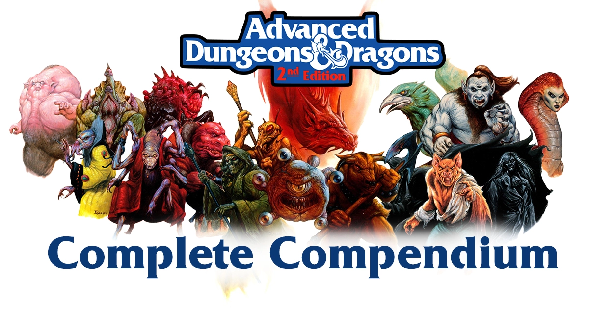

---

Live at [completecompendium.com](https://completecompendium.com)

Support the project at my [Ko-Fi](https://ko-fi.com/novicewizard)


# Complete Compendium - Advanced Dungeons & Dragons 2nd Edition

Quick Links
- [DEVELOPMENT PLAN](https://github.com/decheine/complete-compendium/DEVELOPMENT_PLAN.MD)
- [Book validation checklist](https://github.com/decheine/complete-compendium/issues/2)

## What is the Complete Compendium?

This is a project that compiles and catalogs all monsters from the Advanced Dungeons & Dragons 2nd Edition tabletop roleplaying game. There are currently 23 campaign settings, over 200 books, and over 2000 unique monster pages, with still more to be catalogued.

These thousands of monster pages were scraped with the help of the Wayback machine from an old website at `lomion.de/cmm` that contained (almost) every AD&D 2nd Edition monster. The drawback to that site was that it was minimally navigable, having only an appendix list. This project seeks to finish the task and catalog every monster, book, and setting from oldschool D&D. 


## The Data (the monsters)


`/harvester/cmm` is the location of the data used to generate this static site at build time. `/harvester` contains a C++ program that can run in a Docker container to harvest the monster data and output JSON data. 

Within `/harvester/cmm/` are a collection of HTML files, each being a monster page with its filename being that monster page's `monster_key` (e.g. `aarakath` or `zombie`). These HTML pages reference assets within sibling asset folders like monster images.

<details>
 <summary>Why this data format?</summary>

I chose to keep these as HTML files so that these files are functional on their own with nothing other than a web browser. I explored several database options but ended up with simple JSON files and static site generation. 

</details>


## Cataloguing Effort Tracking

There are a few undertakings that need to be done to complete the compendium. I will use GitHub's Issue tracking with tasks to track them all. These are:
* Validate Books: For each book in the Catalog, verify its monsters and add missing monster keys to catalog book pages. If monster doesn't exist, 
*  Add Missing Monsters: adding a new monster page and key, created from an HTML template. 
*  Add Missing Monster Images
*  Add Missing Book Covers
*  Dragon and Dungeon Magazines

###


## Contributing and making additions 

There are a few needed procedures for completing the compendium. 

### Update a book's monsters

A straightforward task done during Book Verification, this involves checking the sourcebook manually for existing monsters, usually checking a PDF or real book if possible. For each monster in the book, check if the monster exists

### Adding a missing image

Place missing primary monster images in `/static/images/monsters/img/<monster_key>.gif`. They have to be in a `.gif` format.


### Adding a book

If a new monster is found in a book not found in the complete compendium's collection then a new book must be added.

Adding a new book involves modifications to the following data files:

* `/data/all_tsr.json`
* `/data/settings.json`

> Remark: There **must** be a monster page with the new book's `publish_id`, the publication id on the side of the book. If there isn't, the book won't show up right. Should make a test for this.

Steps for adding a new book:

1. Add the book's `publish_id` number to `/data/all_tsr.json` as a key to a book object - include `title`, `year`, `author`'s, and `setting`. The `setting` options can be found in the file `/data/settings.json`.
2. Add the book to it's matching `setting` option in `/data/settings.json`. In the entry for the setting, like Forgotten Realms or Dark Sun, add the new book's `publish_id` to the array of `source_books`.
3. Put a high resolution jpeg image of the cover in the directory `/static/images/Books/Hi Resolution` named `<publish_id>.jpg`.


### Adding a monster

A brand new monster requires a new HTML file to be created for it at `/harvester/cmm/`. There are HTML templates based on different formats, like a single monster and multiple subtypes of monster. 

1. Start in `/harvester/cmm/workspace/`, copy a template to that directory and make some replacements described in the [README](/harvester/cmm/workspace/README.md) there. Make all of the replacements listed. When deciding on a new monster_key, they shouldn't be more than 8 characters. 
2.  Fill in the statblock and paragraph text content, like Comabt, Habitat, Ecology.
3.  Add an image of the monster to the directory `/static/images/monsters/img/` named `<monster_key>.gif`
4.  Make sure to copy the new monster to the `/harvester/cmm/` directory.
5.  Run the harvester. See the following section for running the harvester with Docker. Make sure to run the `node .\scripts\copy_monster_data.js` to copy the output of the harvester once it's done. 
6.  Add all of the monsters titles to the file `/data/Titles_Keys.json` with the Title as the key and the monster_key as the value. Add the title printed on the monster page, and additional reasonable permutations of it. For example, "Elf, Aquatic" also has the title entry "Aquatic Elf". Use your best judgement, usually it will be obvious if a monster should have multiple titles like this. Also include titles that appear in the text as an alternative name the monster is called, like how the "Sahuagin" are also called "Sea Devil."
7.  If everything runs successfully, run the gatsby web app with `gatsby develop` and see if the monster shows up correctly.


## Running locally

In order to build and run the repository you will need Node which you can download from their website.

First, clone the repository with

```
git clone https://github.com/decheine/complete-compendium.git
```

and `cd complete-compendium` into the directory.

Install the dependencies with

```
npm install
```

Run web app development build

```
gatsby develop
```


## Running Monster Harvester in Docker

Most straightforward method with the least hassle. Run all these in the project directory.
 
The data extraction process consists of the following commands:

1. Build the docker image

```bash
docker build -t monster-harvester -f harvester/Dockerfile .
```


2. Create the container

```bash
docker create --name harvester-container monster-harvester
```

3. Get the container ID with


```bash
docker ps -a
```

4. Copy Output from container

```
docker cp <container_id>:/usr/local/harvester/build/bin/json_files output
```

Copies the json files created by the harvester to the folder `./output/json_files/`


### Run Harvester One Liner

Run Harvester all in one command,
```powershell
docker build -t monster-harvester -f harvester/Dockerfile .; docker create --name harvester-container monster-harvester; Foreach-Object { docker cp "harvester-container:/usr/local/harvester/build/bin/json_files" output }
```

5. Run copy script to copy the harvested data into the repository.

```
node .\scripts\copy_monster_data.js
```

## Data Tabulation

Your system will require an installation of R, I recommend just installing RStudio. That should be all you need to do.

6. To update new monsters into the data table, run the rdata script described in package.json with

```
npm run rdata
```

It should take around 20-30 seconds to complete and terminate with a "Tabulation Complete!" message. The `stats_df.json` file is updated with the new data.

## Docker commands


* "Enter" the docker container interactively
```
docker run -it --entrypoint /bin/bash monster-harvester
```

## Scripts

Some auxiliary scripts.

### Missing image checker

A python script that checks each monster html source file and corresponding image (if it calls for one) and tabulates if the monster has a missing image. The script outputs a list of monster keys that have missing images. As of writing this there are 145 known monsters with missing images.

```
python scripts/image_checker.py
```

## Markdown Templating

<details>
 <summary>Summary Text</summary>

The text here

</details>
