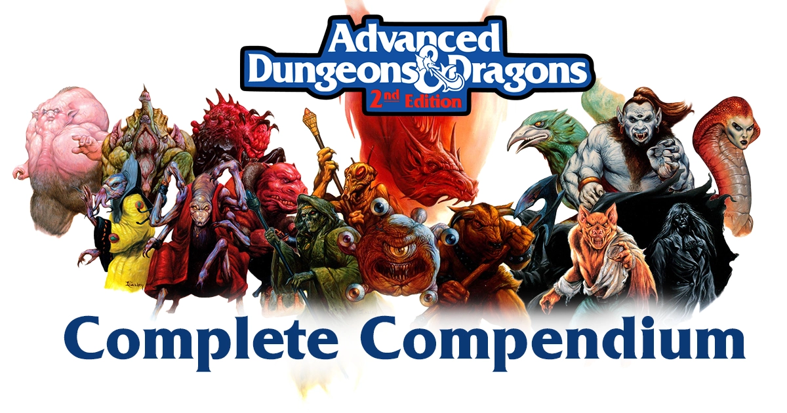

---

Live at [completecompendium.com](https://completecompendium.com)

# Complete Compendium - Advanced Dungeons & Dragons 2nd Edition

## What is the Complete Compendium?

This is a project to compile and catalog all monsters from the Advanced Dungeons & Dragons 2nd Edition tabletop roleplaying game. There are currently 23 campaign settings, over 200 books, and over 2000 unique monster pages, with still more to be catalogued.

These thousands of monster pages were scraped with the help of the Wayback machine from an old website at `lomion.de/cmm` that contained (almost) every AD&D 2nd Edition monster. The drawback was the site was minimally navigable, having only an appendix list. This project seeks to finish what the original creator started and catalog every monster, book, and setting from oldschool D&D. 


## The Data (the monsters)


`/cmm` is a submodule repository and the location of the data used to generate this static site at build time. It contains a C++ program that can run in a Docker container to harvest the monster data and output JSON data. 

Within `/cmm/cmm/` are a collection of HTML files, each being a monster page with its filename being that monster page's `monster_key` (e.g. `aarakath` or `zombie`). These HTML pages reference assets within sibling asset folders like monster images.

<details>
 <summary>Why this data format?</summary>

I chose to keep these as HTML files so that these files are functional on their own with nothing other than a web browser. I explored several database options but ended up with simple JSON files and static site generation. 

</details>

### Catalog

This effort involves cataloguing all of the second edition books and sources that contain monster pages.


## Cataloguing Effort Tracking

There are a few undertakings that need to be done to complete the compendium. I will use GitHub's Issue tracking with tasks to track them all. These are:
* Validate Books: For each book in the Catalog, verify its monsters and add missing monster keys to catalog book pages. If monster doesn't exist, 
*  Add Missing Monsters: adding a new monster page and key, created from an HTML template. 
*  Add Missing Monster Images
*  Add Missing Book Covers
*  Dragon and Dungeon Magazines

###


## Contributing and making additions 

There are a few needed procedures for completing the compendium. 

### Update a book's monsters

A straightforward task done during Book Verification, this involves checking the sourcebook manually for existing monsters, usually checking a PDF or real book if possible. For each monster in the book, check if the monster exists

### Adding a missing image

Place missing primary monster images in `/static/images/monsters/img/<monster_key>.gif`. They have to be in a `.gif` format.


### Adding a book


### Adding a monster


## Running locally

Run web app development build

```
npm run develop
```


## Running Monster Harvester in Docker

Most straightforward method with the least hassle. Run all these in the project directory.
 
To run the data extraction process,

1. Build the docker image

```bash
docker build -t monster-harvester -f harvester/Dockerfile .
```

2. Create the container

```bash
docker create --name harvester-container monster-harvester
```

3. Get the container ID with

```bash
docker ps -a
```

3. Copy Output from container

```
docker cp <container_id>:/usr/local/harvester/build/bin/json_files output
```

Copies the json files created by the harvester to the folder `./output/json_files/`


In one command,
```powershell
docker create --name harvester-container monster-harvester | Foreach-Object { docker cp "$($_):/usr/local/harvester/build/bin/json_files" output }
```

## Docker commands


* "Enter" the docker container interactively
```
docker run -it --entrypoint /bin/bash monster-harvester
```


## Markdown Templating

<details>
 <summary>Summary Text</summary>

The text here

</details>